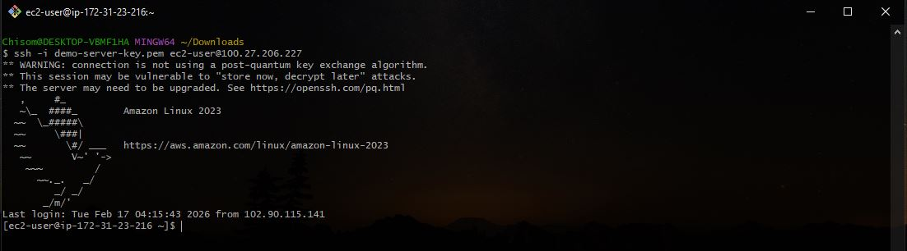
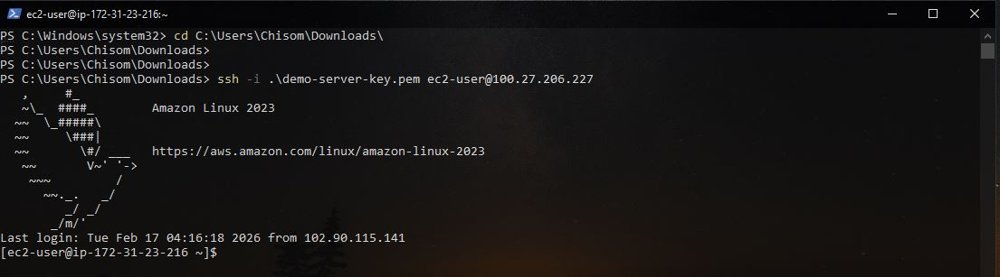
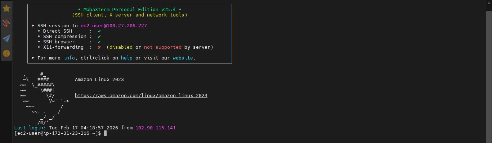
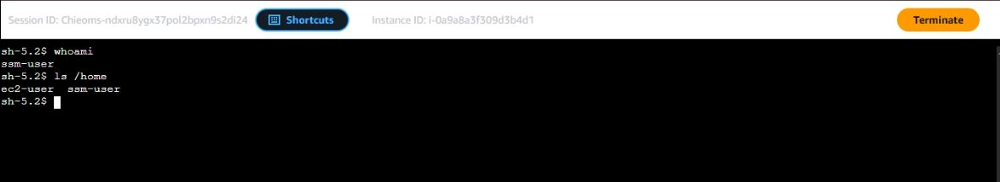
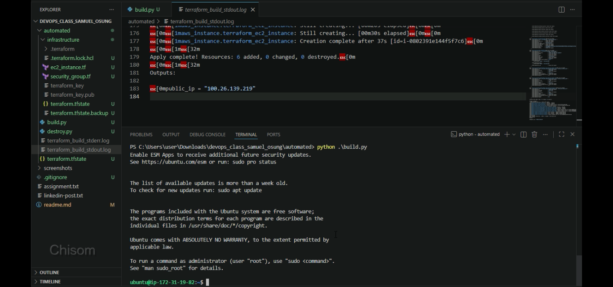

# ASSIGMENT: CONNECTING TO EC2 INSTANCE 
 
**INTRODUCTION** 
In this assignment, I connected to an EC2 instance using multiple methods: 
*See assignment details [Assignment details](./assignment.txt).*
 
## TRADITIONAL SSH (Secure Shell): 
**Git Bash:**   
  
   
**Powershell:**   
   
   
**MobaXterm:**   
 
   
## AWS SYSTEMS MANAGER (SSM): 
I also explored EC2 Instance Connect (browser-based SSH), but then tried the more secure alternative: SSM Session Manager. 
  
   
**WHY I PREFER LOGGING IN TO EC2 INSTANCE USING SSM (SYSTEMS MANAGER)**   
**More secure**   
No need to open port 22 in security groups, no permanent SSH keys to manage, and access is controlled entirely via IAM roles/policies.   
*Works perfectly for instances in private subnets (no public IP or bastion host required).  
   
**Faster subsequent connections**   
The first connection may take a little longer (due to agent handshake/setup), but afterwards it's usually one-click instant access via the AWS Console or CLI.  
   
**Recommended for production environments**   
AWS strongly promotes SSM Session Manager for secure, auditable access without exposing instances to the internet. 
   
Revisiting this assignment helped me gain hands-on experience with SSM Session Manager — a key skill for secure cloud operations.   
   
*See video on youtube* [Screen record](https://youtu.be/FmNxBeQBuQc).*   
   
   
# AUTOMATED
**With: Python and Terraform**   
    
**ASSIGNMENT DETAILS**

In this automated version:
- I Launched an EC2 instance using Terraform
- Automatically logs into the instance after provisioning
- Uses Python scripts to orchestrate the workflow:

  - **build.py**
    - Runs `terraform apply`
    - Logs into the instance after successful creation
    - Generates SSH key pairs only if they do not already exist
    - Redirects `stdout` and `stderr` to separate files

  - **destroy.py**
    - Runs `terraform destroy`
    - Deletes SSH key pairs only if they exist
    - Redirects `stdout` and `stderr` to separate files

**REQUIREMNTS**
- AWS CLI installed and configured (IAM user with access key). *see [coming soon!]*
- Terraform installed   *see [coming soon!]*
- Python installed  *see [coming soon!]*
- Powershell (Recommended) 

***Note:*** *I built this script to automate what I had already built, so it will work as long as you don’t modify it.*   
***Change directory to the `automated` folder and run the scripts (`python build.py` to create and log in to the EC2 instance, and `python destroy.py` to destroy the infrastructure created by `build.py`), provided you have set up all the requirements.***
   
 
   
*See video on youtube* [Screen record](https://youtu.be/9ElxJJAmwBA).*
